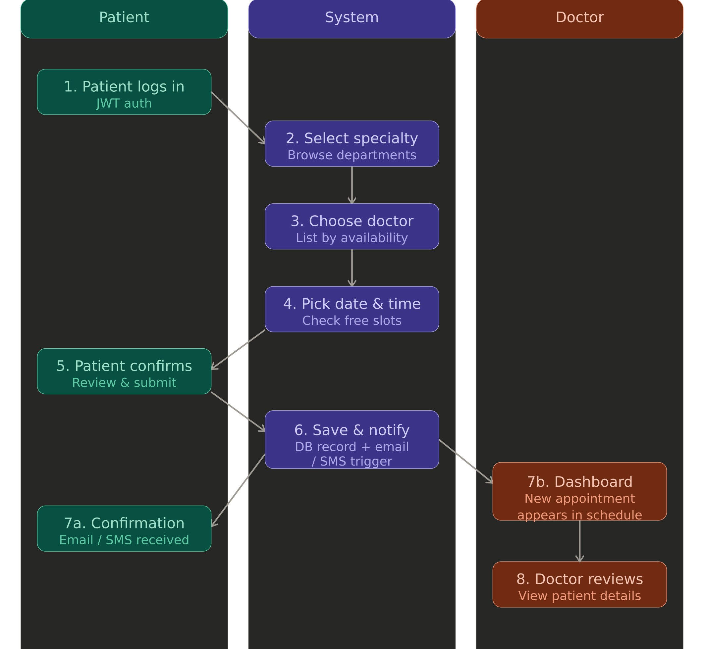
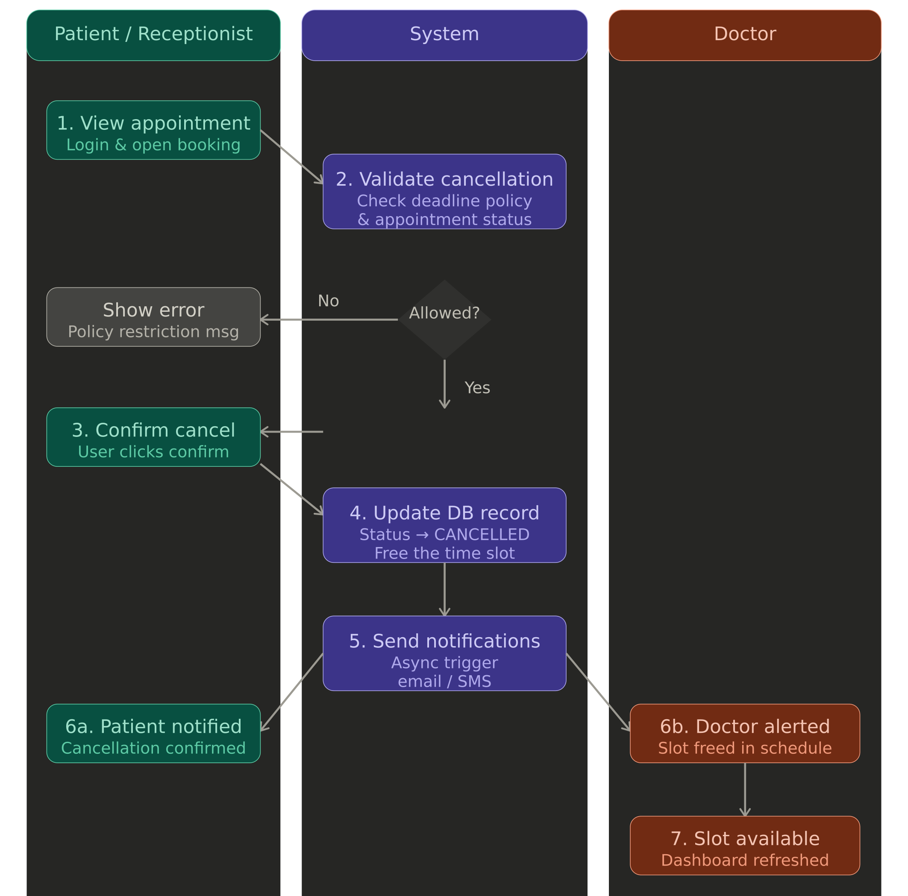

# Hospital Appointment Management System

A full-stack web application that allows patients to book appointments with doctors, and lets hospital staff manage schedules and user accounts. Built with **Spring Boot** (back-end) and **Angular** (front-end).

---

## Tech Stack

| Layer | Technology |
|-------|-----------|
| Back-end | Spring Boot 3.5, Spring Security, Spring Data JPA |
| Database | SQLite (file-based, zero config) |
| Auth | JWT (JSON Web Tokens) |
| API Docs | Swagger UI (SpringDoc OpenAPI) |
| Front-end | Angular 19, TypeScript, SCSS |
| Build | Maven (back-end), npm (front-end) |

---

## Project Structure

```
Hospital-Appointment-System/
├── backend/
│   └── src/main/java/com/hospital/appointment/
│       ├── api/
│       │   ├── appointment/    # Appointment module (Controller, Service, DTOs)
│       │   ├── doctor/         # Doctor module (Controller, Service, DTOs)
│       │   ├── admin/          # User management module (Controller, Service, DTOs)
│       │   ├── auth/           # Authentication (login, register, JWT)
│       │   └── user/           # User directory (read-only listing)
│       ├── domain/             # JPA Entities (User, Doctor, Appointment)
│       ├── repository/         # Spring Data repositories
│       ├── config/             # Security, CORS, Swagger, DataSeed
│       └── security/           # JWT filter, UserDetails, UserPrincipal
├── frontend/
│   └── src/app/
│       ├── appointments/       # Appointments component
│       ├── doctors/            # Doctors list component
│       ├── doctor-detail/      # Doctor detail component
│       ├── dashboard/          # Dashboard component
│       ├── users/              # User management component (admin)
│       ├── auth/               # Login & Register components + guards
│       ├── services/           # Service files (one per feature)
│       └── models/             # TypeScript model/interface files
└── docs/                       # Project documentation
```

---

## Back-end Modules (Spring Boot)

The API exposes **3 main modules**, each with full **CRUD** operations:

### 1. Appointment Module (`/api/appointments`)

| Method | Endpoint | Description |
|--------|----------|-------------|
| GET | `/api/appointments` | List all appointments (filter by `?doctorId=`) |
| GET | `/api/appointments/{id}` | Get appointment by ID |
| POST | `/api/appointments` | Create a new appointment |
| PUT | `/api/appointments/{id}` | Update an existing appointment |
| DELETE | `/api/appointments/{id}` | Delete an appointment |

### 2. Doctor Module (`/api/doctors`)

| Method | Endpoint | Description |
|--------|----------|-------------|
| GET | `/api/doctors` | List all doctors |
| GET | `/api/doctors/{id}` | Get doctor by ID |
| POST | `/api/doctors` | Create a new doctor |
| PUT | `/api/doctors/{id}` | Update doctor info |
| DELETE | `/api/doctors/{id}` | Delete a doctor |

### 3. User Management Module (`/api/admin/users`)

| Method | Endpoint | Description |
|--------|----------|-------------|
| GET | `/api/admin/users` | List all users |
| GET | `/api/admin/users/{id}` | Get user by ID |
| POST | `/api/admin/users` | Create a new user |
| PUT | `/api/admin/users/{id}` | Update user details |
| DELETE | `/api/admin/users/{id}` | Delete a user |

### Additional Endpoints

- `POST /api/auth/register` — Register a new patient account
- `POST /api/auth/login` — Login and receive a JWT token
- `GET /api/auth/me` — Get the current authenticated user
- `GET /api/users/directory` — Read-only user listing

### Swagger UI

The API is documented and testable via **Swagger UI**, available at:

```
http://localhost:8080/swagger-ui.html
```

Use the **Authorize** button with a JWT token obtained from `/api/auth/login`.

---

## Front-end (Angular)

### Components

| Component | Path | Description |
|-----------|------|-------------|
| LoginComponent | `/login` | User login form |
| RegisterComponent | `/register` | Patient registration form |
| DashboardComponent | `/dashboard` | Main dashboard (landing page) |
| DoctorsComponent | `/doctors` | List and manage doctors |
| DoctorDetailComponent | `/doctors/:id` | View/edit a specific doctor |
| AppointmentsComponent | `/appointments` | List, create, edit, delete appointments |
| UsersComponent | `/users` | Admin user management (CRUD) |

### Services (`frontend/src/app/services/`)

| Service | Purpose |
|---------|---------|
| `appointments.service.ts` | Appointment CRUD calls |
| `doctors.service.ts` | Doctor CRUD calls |
| `users.service.ts` | Admin user management calls |
| `login.service.ts` | Login authentication |
| `register.service.ts` | Registration |
| `auth-session.service.ts` | JWT session management |
| `dashboard.service.ts` | Dashboard data |
| `user-directory.service.ts` | Read-only user listing |

### Models (`frontend/src/app/models/`)

| Model | Purpose |
|-------|---------|
| `appointment.model.ts` | Appointment & AppointmentRequest interfaces |
| `doctor.model.ts` | Doctor & DoctorRequest interfaces |
| `users.model.ts` | CreateUserBody & UpdateUserBody interfaces |
| `auth.model.ts` | AuthResponse, UserResponse, Role types |
| `login.model.ts` | LoginRequest interface |
| `register.model.ts` | RegisterRequest interface |
| `dashboard.model.ts` | DashboardProfile type |
| `user-directory.model.ts` | User directory types |

---

## Actors & Roles

| Actor | Role |
|-------|------|
| Patient | Books and manages own appointments |
| Doctor | Views schedule, manages records |
| Receptionist | Manages bookings on behalf of patients |
| Admin | Full system control (users, doctors, appointments) |

---

## How to Run

### Prerequisites

- **Java 17+** (for the back-end)
- **Node.js 18+** and **npm** (for the front-end)

### 1. Start the Back-end

```bash
cd backend
./mvnw spring-boot:run
```

The API will be available at `http://localhost:8080`.

### 2. Start the Front-end

```bash
cd frontend
npm install
ng serve
```

The Angular app will be available at `http://localhost:4200` and proxies API requests to `http://localhost:8080`.

### Default Admin Credentials

| Field | Value |
|-------|-------|
| Email | `admin@hospital.test` |
| Password | `Admin123!` |

---

## Key Workflows

### Appointment Booking Flow



### Cancellation Flow



---

## Testing

### Back-end Tests

The project includes integration tests for the Appointment module using Spring Boot Test and MockMvc:

```bash
cd backend
./mvnw test
```

### Swagger API Testing

Open `http://localhost:8080/swagger-ui.html` to interactively test all API endpoints.

---
